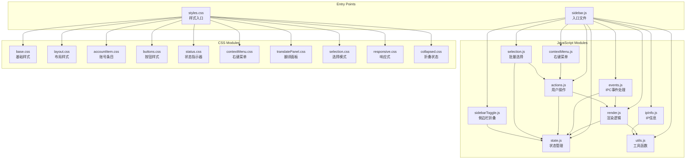
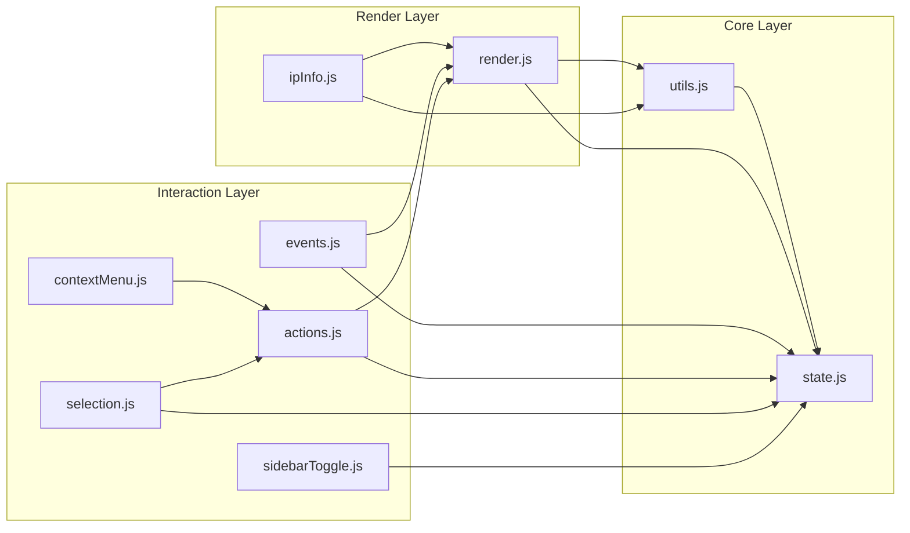

# Design Document: Sidebar Modular Refactoring

## Overview

本设计文档描述了将 `sidebar.js`（约2600行）和 `styles.css`（约1760行）拆分为模块化结构的技术方案。采用直接拆分策略，将原始大文件替换为模块入口文件和多个职责单一的子模块。

### 设计原则

1. **单一职责原则 (SRP)**: 每个模块只负责一个功能领域
2. **开闭原则 (OCP)**: 模块对扩展开放，对修改关闭
3. **依赖倒置原则 (DIP)**: 高层模块不依赖低层模块，都依赖抽象
4. **KISS原则**: 保持简单，避免过度设计
5. **DRY原则**: 避免重复代码

## Architecture

### 整体架构图



### 模块依赖关系图



## Components and Interfaces

### JavaScript 模块接口

#### 1. state.js - 状态管理模块 (~100行)

```javascript
// 导出的状态
export let accounts = [];
export let activeAccountId = null;
export let filterQuery = '';
export let renderVersion = 0;
export let selectionMode = false;
export let selectedAccountIds = new Set();

// 导出的方法
export function setAccounts(newAccounts) { ... }
export function setActiveAccountId(id) { ... }
export function setFilterQuery(query) { ... }
export function incrementRenderVersion() { ... }
export function toggleSelectionMode() { ... }
export function clearSelectedAccounts() { ... }
export function addSelectedAccount(id) { ... }
export function removeSelectedAccount(id) { ... }
export function getAccountById(id) { ... }
export function updateAccount(id, updates) { ... }
```

#### 2. utils.js - 工具函数模块 (~150行)

```javascript
export function getAccountInitial(name) { ... }
export function getAccountColor(accountId) { ... }
export function getStatusText(status) { ... }
export function copyToClipboard(text, element) { ... }
export function getFlagEmoji(countryCode) { ... }
export function debounce(fn, delay) { ... }
export function showError(message) { ... }
```

#### 3. render.js - 渲染逻辑模块 (~400行)

```javascript
import * as state from './state.js';
import * as utils from './utils.js';

export function renderAccountList() { ... }
export function createAccountItem(account, options) { ... }
export function renderStatusDot(account, dotElement) { ... }
export function renderQuickActions(account, actions) { ... }
export function renderUnreadBadge(account, container) { ... }
export function applyAccountProfileToItem(account, item) { ... }
export function updateAccountStatus(accountId, status) { ... }
export function updateAccountRunningStatus(accountId, runningStatus) { ... }
export function setActiveAccount(accountId) { ... }
```

#### 4. events.js - IPC事件处理模块 (~350行)

```javascript
import * as state from './state.js';
import * as render from './render.js';

export function setupEventListeners() { ... }
export function handleAccountsUpdated(accountsData) { ... }
export function handleAccountSwitched(accountId) { ... }
export function handleAccountStatusChanged(data) { ... }
export function handleActiveAccountChanged(data) { ... }
export function handleViewLoading(data) { ... }
export function handleViewReady(data) { ... }
export function handleViewError(data) { ... }
export function handleLoginStatusChanged(data) { ... }
export function handleViewCrashed(data) { ... }
export function handleConnectionStatusChanged(data) { ... }
export function handleAccountProfileUpdated(data) { ... }
export function handleUnreadCountUpdated(data) { ... }
export function handleAccountOpening(data) { ... }
export function handleAccountOpened(data) { ... }
export function handleAccountOpenFailed(data) { ... }
export function handleAccountClosing(data) { ... }
export function handleAccountClosed(data) { ... }
export function handleAccountCloseFailed(data) { ... }
```

#### 5. actions.js - 用户操作模块 (~250行)

```javascript
import * as state from './state.js';
import * as render from './render.js';

export async function loadAccounts() { ... }
export async function handleAccountSelect(accountId) { ... }
export async function handleAddAccount() { ... }
export async function handleDeleteAccount(accountId) { ... }
export async function handleOpenAccount(accountId) { ... }
export async function handleCloseAccount(accountId) { ... }
export async function handleRetryAccount(accountId) { ... }
export async function saveAccountNote(accountId, note) { ... }
export function openEnvironmentPanel(accountId) { ... }
export function mergeRunningStatuses(statuses) { ... }
export function syncAccountStatusWithRunningStatus(account) { ... }
export function syncAccountStatusesWithRunningStatus() { ... }
export async function refreshLoginStatusesForAllAccounts() { ... }
```

#### 6. contextMenu.js - 右键菜单模块 (~100行)

```javascript
import * as actions from './actions.js';

export function handleContextMenu(e, account) { ... }
export function createContextMenu(account) { ... }
export function positionContextMenu(menu, e) { ... }
```

#### 7. selection.js - 批量选择模块 (~150行)

```javascript
import * as state from './state.js';
import * as actions from './actions.js';
import * as render from './render.js';

export function toggleSelectionMode() { ... }
export function selectAllAccounts() { ... }
export function updateSelectionUI() { ... }
export async function handleBatchStartAll() { ... }
export async function handleBatchStartSelected() { ... }
export async function handleBatchDeleteSelected() { ... }
```

#### 8. ipInfo.js - IP信息模块 (~200行)

```javascript
import * as utils from './utils.js';
import * as render from './render.js';

export async function fetchAndRenderIPInfo(account, item) { ... }
export function renderIPDetails(container, info, account) { ... }
export function renderIPError(container, message, fullError, account) { ... }
export function createEnvInfoIcon(account) { ... }
export async function getLocalPublicIP(force) { ... }
export async function getAccountUA(accountId) { ... }
export async function getProxyIPInfo(account) { ... }
export async function refreshAccountIPInfo(accountId) { ... }
```

#### 9. sidebarToggle.js - 侧边栏折叠模块 (~100行)

```javascript
import * as state from './state.js';

export function toggleSidebar() { ... }
export function restoreSidebarState() { ... }
```

#### 10. sidebar.js - 入口文件 (~80行)

```javascript
// 导入所有模块
import * as state from './sidebar/state.js';
import * as utils from './sidebar/utils.js';
import * as render from './sidebar/render.js';
import * as events from './sidebar/events.js';
import * as actions from './sidebar/actions.js';
import * as contextMenu from './sidebar/contextMenu.js';
import * as selection from './sidebar/selection.js';
import * as ipInfo from './sidebar/ipInfo.js';
import * as sidebarToggle from './sidebar/sidebarToggle.js';

// 初始化函数
function init() {
  events.setupEventListeners();
  actions.loadAccounts();
}

// 导出公共API（保持向后兼容）
window.sidebar = {
  loadAccounts: actions.loadAccounts,
  renderAccountList: render.renderAccountList,
  setActiveAccount: render.setActiveAccount,
  getAccounts: () => state.accounts,
  getActiveAccountId: () => state.activeAccountId,
  renderQuickActions: render.renderQuickActions,
  syncAccountStatusesWithRunningStatus: actions.syncAccountStatusesWithRunningStatus,
  toggleSidebar: sidebarToggle.toggleSidebar,
  toggleSelectionMode: selection.toggleSelectionMode,
  handleBatchStartAll: selection.handleBatchStartAll
};

// DOM Ready 初始化
if (document.readyState === 'loading') {
  document.addEventListener('DOMContentLoaded', init);
} else {
  init();
}
```

### CSS 模块结构

#### 1. base.css - 基础样式 (~80行)
- CSS Reset
- CSS 变量定义
- 全局字体和颜色

#### 2. layout.css - 布局样式 (~100行)
- #app 容器
- #sidebar 布局
- .sidebar-header
- #view-container
- .resize-handle

#### 3. accountItem.css - 账号条目样式 (~200行)
- .account-item
- .account-avatar-container
- .account-avatar
- .account-info
- .account-header
- .account-name
- .account-secondary
- .account-phone
- .account-note
- .account-collapsed-name
- .account-ip-info

#### 4. buttons.css - 按钮样式 (~150行)
- .btn-primary
- .btn-icon
- .action-btn
- .open-btn, .close-btn, .retry-btn
- .edit-btn, .delete-btn
- .loading-indicator

#### 5. status.css - 状态指示器样式 (~80行)
- .status-dot
- .status-dot.online/warning/error/loading
- .unread-badge
- .spinner
- @keyframes spin
- @keyframes pulse

#### 6. contextMenu.css - 右键菜单样式 (~60行)
- .custom-context-menu
- .menu-item
- .menu-icon
- .menu-separator

#### 7. translatePanel.css - 翻译面板样式 (~200行)
- .translate-panel
- .translate-panel-header
- .translate-panel-body
- .translate-panel-menu
- .panel-menu-btn
- 面板状态样式

#### 8. selection.css - 选择模式样式 (~100行)
- .selection-action-bar
- .selection-btn
- .selection-checkbox
- .account-item.in-selection-mode
- .account-item.selected

#### 9. responsive.css - 响应式样式 (~80行)
- @media (max-width: 1000px)
- @media (max-width: 768px)

#### 10. collapsed.css - 折叠状态样式 (~150行)
- #sidebar[data-collapsed="true"] 相关样式
- 折叠状态下的账号条目
- 折叠状态下的头像和信息

#### 11. styles.css - 入口文件 (~30行)

```css
/* 样式入口文件 - 导入所有模块 */
@import './styles/base.css';
@import './styles/layout.css';
@import './styles/accountItem.css';
@import './styles/buttons.css';
@import './styles/status.css';
@import './styles/contextMenu.css';
@import './styles/translatePanel.css';
@import './styles/selection.css';
@import './styles/responsive.css';
@import './styles/collapsed.css';
```

## Data Models

### 账号数据模型

```javascript
{
  id: string,                    // 唯一标识
  name: string,                  // 账号名称
  profileName: string,           // WhatsApp昵称
  phoneNumber: string,           // 电话号码
  note: string,                  // 备注
  avatarUrl: string,             // 头像URL
  order: number,                 // 排序顺序
  autoStart: boolean,            // 自动启动
  
  // 运行状态
  runningStatus: 'not_started' | 'loading' | 'connected' | 'error',
  isRunning: boolean,
  
  // 登录状态
  loginStatus: boolean,
  hasQRCode: boolean,
  loginInfo: object,
  
  // 连接状态
  connectionStatus: string,
  connectionError: object,
  connectionDetails: object,
  
  // 显示状态
  status: 'online' | 'offline' | 'loading' | 'error',
  
  // 未读消息
  unreadCount: number,
  
  // IP信息缓存
  lastIPInfo: object,
  lastIPInfoTimestamp: number,
  
  // 翻译配置
  translation: object
}
```

### 状态模型

```javascript
{
  accounts: Account[],           // 账号列表
  activeAccountId: string,       // 当前激活账号ID
  filterQuery: string,           // 搜索过滤词
  renderVersion: number,         // 渲染版本号（防止竞态）
  selectionMode: boolean,        // 是否处于选择模式
  selectedAccountIds: Set<string> // 已选中的账号ID集合
}
```

## Correctness Properties

*A property is a characteristic or behavior that should hold true across all valid executions of a system-essentially, a formal statement about what the system should do. Properties serve as the bridge between human-readable specifications and machine-verifiable correctness guarantees.*

### Property 1: API Interface Preservation
*For any* method name in the original `window.sidebar` interface, the refactored module SHALL expose a method with the same name that accepts the same parameters and returns the same type of result.
**Validates: Requirements 1.3, 4.2**

### Property 2: IPC Event Handler Equivalence
*For any* IPC event type and event data, the refactored event handler SHALL produce the same state changes as the original implementation.
**Validates: Requirements 4.1**

### Property 3: User Interaction Equivalence
*For any* sequence of user interactions (click, keydown, contextmenu), the refactored implementation SHALL produce the same DOM state and application state as the original.
**Validates: Requirements 4.4**

### Property 4: CSS Class Style Preservation
*For any* CSS class name used in the original styles.css, the refactored stylesheets SHALL define the same CSS properties with the same values.
**Validates: Requirements 4.5, 4.6**

## Error Handling

### 模块加载错误
- 如果子模块加载失败，入口文件应捕获错误并显示友好提示
- 使用 try-catch 包装模块初始化代码

### 状态同步错误
- 状态更新失败时，保持原有状态不变
- 记录错误日志便于调试

### IPC通信错误
- IPC调用失败时，显示用户友好的错误消息
- 实现重试机制（如适用）

## Testing Strategy

### 双重测试方法

本项目采用单元测试和属性测试相结合的方式：

1. **单元测试**: 验证具体示例和边界情况
2. **属性测试**: 验证应在所有输入上成立的通用属性

### 属性测试框架

使用 **fast-check** 作为属性测试库，配置每个属性测试运行至少100次迭代。

### 测试标注格式

每个属性测试必须使用以下格式标注：
```javascript
// **Feature: sidebar-modular-refactoring, Property {number}: {property_text}**
```

### 单元测试覆盖

1. **模块加载测试**
   - 验证所有模块正确加载
   - 验证无循环依赖

2. **API兼容性测试**
   - 验证 window.sidebar 所有方法存在
   - 验证方法签名正确

3. **文件行数验证**
   - 验证每个文件不超过500行

4. **CSS规则完整性测试**
   - 验证所有原始CSS类名存在
   - 验证CSS规则数量一致

### 属性测试覆盖

1. **Property 1: API Interface Preservation**
   - 生成随机方法调用
   - 验证返回类型一致

2. **Property 2: IPC Event Handler Equivalence**
   - 生成随机事件数据
   - 验证状态变化一致

3. **Property 3: User Interaction Equivalence**
   - 生成随机交互序列
   - 验证DOM状态一致

4. **Property 4: CSS Class Style Preservation**
   - 生成随机CSS类名
   - 验证计算样式一致
