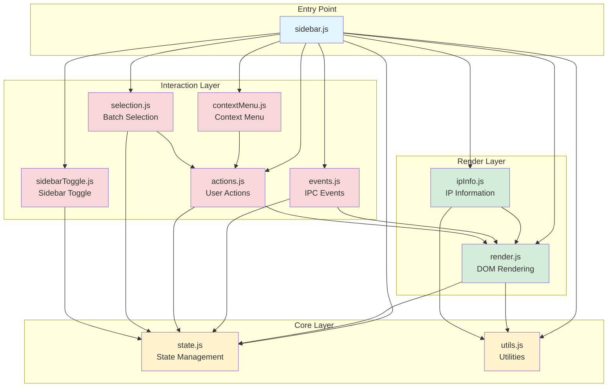

# Sidebar Module Structure Documentation

**Last Updated:** December 8, 2025  
**Version:** 2.0 (Modular Architecture)

## Overview

The sidebar component has been refactored from a monolithic 2,600-line file into a modular architecture with clear separation of concerns. This document describes the module structure, dependencies, and usage patterns.

## Architecture Principles

1. **Single Responsibility Principle (SRP)**: Each module handles one specific concern
2. **Dependency Inversion**: High-level modules don't depend on low-level modules
3. **Open/Closed Principle**: Modules are open for extension, closed for modification
4. **KISS**: Keep implementations simple and focused
5. **DRY**: Avoid code duplication across modules

## Directory Structure

```
src/single-window/renderer/
├── sidebar.js                    # Entry point (212 lines)
├── sidebar/                      # Module directory
│   ├── state.js                  # State management (257 lines)
│   ├── utils.js                  # Utility functions (240 lines)
│   ├── render.js                 # Rendering logic (419 lines)
│   ├── events.js                 # IPC event handlers (586 lines)
│   ├── actions.js                # User actions (656 lines)
│   ├── contextMenu.js            # Context menu (153 lines)
│   ├── selection.js              # Batch selection (270 lines)
│   ├── ipInfo.js                 # IP information (454 lines)
│   ├── sidebarToggle.js          # Sidebar collapse (144 lines)
│   └── __tests__/                # Test files
│       ├── api.property.test.js
│       ├── events.property.test.js
│       └── css.property.test.js
├── styles.css                    # CSS entry point (30 lines)
└── styles/                       # CSS modules
    ├── base.css                  # Base styles (80 lines)
    ├── layout.css                # Layout styles (100 lines)
    ├── accountItem.css           # Account item styles (200 lines)
    ├── buttons.css               # Button styles (150 lines)
    ├── status.css                # Status indicator styles (80 lines)
    ├── contextMenu.css           # Context menu styles (60 lines)
    ├── translatePanel.css        # Translation panel styles (200 lines)
    ├── selection.css             # Selection mode styles (100 lines)
    ├── responsive.css            # Responsive styles (80 lines)
    └── collapsed.css             # Collapsed state styles (150 lines)
```

## Module Dependency Graph



## Module Details

### 1. sidebar.js (Entry Point)

**Purpose**: Main entry point that coordinates all modules and exposes the public API.

**Responsibilities**:
- Import and initialize all sub-modules
- Set up event listeners
- Expose `window.sidebar` API for backward compatibility
- Handle DOM ready initialization

**Public API**:
```javascript
window.sidebar = {
  loadAccounts: actions.loadAccounts,
  renderAccountList: render.renderAccountList,
  setActiveAccount: render.setActiveAccount,
  getAccounts: () => state.accounts,
  getActiveAccountId: () => state.activeAccountId,
  renderQuickActions: render.renderQuickActions,
  syncAccountStatusesWithRunningStatus: actions.syncAccountStatusesWithRunningStatus,
  toggleSidebar: sidebarToggle.toggleSidebar,
  toggleSelectionMode: selection.toggleSelectionMode,
  handleBatchStartAll: selection.handleBatchStartAll
};
```

**Dependencies**: All modules
**Dependents**: External code (main process, other renderer scripts)

---

### 2. state.js (State Management)

**Purpose**: Centralized state management for the sidebar component.

**Responsibilities**:
- Store and manage application state
- Provide getters and setters for state properties
- Ensure state consistency
- Prevent direct state mutation

**State Properties**:
```javascript
{
  accounts: [],              // Array of account objects
  activeAccountId: null,     // Currently active account ID
  filterQuery: '',           // Search filter text
  renderVersion: 0,          // Render version for race condition prevention
  selectionMode: false,      // Whether selection mode is active
  selectedAccountIds: Set    // Set of selected account IDs
}
```

**Key Functions**:
- `setAccounts(newAccounts)` - Update accounts array
- `setActiveAccountId(id)` - Set active account
- `setFilterQuery(query)` - Update filter query
- `incrementRenderVersion()` - Increment render version
- `toggleSelectionMode()` - Toggle selection mode
- `getAccountById(id)` - Get account by ID
- `updateAccount(id, updates)` - Update specific account

**Dependencies**: None
**Dependents**: render.js, events.js, actions.js, selection.js, sidebarToggle.js

---

### 3. utils.js (Utility Functions)

**Purpose**: Reusable utility functions used across modules.

**Responsibilities**:
- Provide helper functions for common operations
- Handle string manipulation and formatting
- Provide clipboard operations
- Implement debounce and other timing utilities

**Key Functions**:
- `getAccountInitial(name)` - Get account initial letter
- `getAccountColor(accountId)` - Generate consistent color for account
- `getStatusText(status)` - Get human-readable status text
- `copyToClipboard(text, element)` - Copy text to clipboard with feedback
- `getFlagEmoji(countryCode)` - Get flag emoji for country code
- `debounce(fn, delay)` - Debounce function calls
- `showError(message)` - Display error message to user

**Dependencies**: None
**Dependents**: render.js, ipInfo.js

---

### 4. render.js (DOM Rendering)

**Purpose**: Handle all DOM rendering and manipulation.

**Responsibilities**:
- Render account list
- Create and update account items
- Render status indicators
- Apply account profiles to UI elements
- Update UI based on state changes

**Key Functions**:
- `renderAccountList()` - Render complete account list
- `createAccountItem(account, options)` - Create single account item
- `renderStatusDot(account, dotElement)` - Render status indicator
- `renderQuickActions(account, actions)` - Render action buttons
- `renderUnreadBadge(account, container)` - Render unread count badge
- `applyAccountProfileToItem(account, item)` - Apply profile data to item
- `updateAccountStatus(accountId, status)` - Update account status
- `setActiveAccount(accountId)` - Set active account in UI

**Dependencies**: state.js, utils.js
**Dependents**: events.js, actions.js, ipInfo.js

---

### 5. events.js (IPC Event Handlers)

**Purpose**: Handle all IPC events from the main process.

**Responsibilities**:
- Set up IPC event listeners
- Handle account-related events
- Handle view-related events
- Update UI based on events
- Coordinate with other modules

**Key Events Handled**:
- `accounts-updated` - Account list updated
- `account-switched` - Active account changed
- `account-status-changed` - Account status changed
- `view-loading` - View is loading
- `view-ready` - View is ready
- `view-error` - View encountered error
- `login-status-changed` - Login status changed
- `unread-count-updated` - Unread count updated
- `account-profile-updated` - Account profile updated
- `account-opening/opened/open-failed` - Account opening events
- `account-closing/closed/close-failed` - Account closing events

**Dependencies**: state.js, render.js
**Dependents**: None (event-driven)

---

### 6. actions.js (User Actions)

**Purpose**: Handle user-initiated actions and operations.

**Responsibilities**:
- Load accounts from main process
- Handle account selection
- Handle account CRUD operations
- Manage account lifecycle (open/close/retry)
- Sync account statuses
- Handle account notes

**Key Functions**:
- `loadAccounts()` - Load accounts from main process
- `handleAccountSelect(accountId)` - Handle account selection
- `handleAddAccount()` - Handle add account action
- `handleDeleteAccount(accountId)` - Handle delete account action
- `handleOpenAccount(accountId)` - Open account
- `handleCloseAccount(accountId)` - Close account
- `handleRetryAccount(accountId)` - Retry failed account
- `saveAccountNote(accountId, note)` - Save account note
- `syncAccountStatusesWithRunningStatus()` - Sync all account statuses

**Dependencies**: state.js, render.js
**Dependents**: contextMenu.js, selection.js

---

### 7. contextMenu.js (Context Menu)

**Purpose**: Handle right-click context menu functionality.

**Responsibilities**:
- Create context menu on right-click
- Position menu correctly
- Handle menu item actions
- Clean up menu on close

**Key Functions**:
- `handleContextMenu(e, account)` - Handle context menu event
- `createContextMenu(account)` - Create menu DOM element
- `positionContextMenu(menu, e)` - Position menu at cursor

**Menu Items**:
- Open Account
- Close Account
- Edit Account
- Delete Account
- Copy Account ID
- Refresh IP Info

**Dependencies**: actions.js
**Dependents**: None (event-driven)

---

### 8. selection.js (Batch Selection)

**Purpose**: Handle batch selection and operations.

**Responsibilities**:
- Toggle selection mode
- Handle account selection
- Render selection UI
- Execute batch operations

**Key Functions**:
- `toggleSelectionMode()` - Toggle selection mode on/off
- `selectAllAccounts()` - Select all accounts
- `updateSelectionUI()` - Update selection UI state
- `handleBatchStartAll()` - Start all accounts
- `handleBatchStartSelected()` - Start selected accounts
- `handleBatchDeleteSelected()` - Delete selected accounts

**Dependencies**: state.js, actions.js, render.js
**Dependents**: None (user-initiated)

---

### 9. ipInfo.js (IP Information)

**Purpose**: Fetch and display IP information for accounts.

**Responsibilities**:
- Fetch IP information from main process
- Render IP details in UI
- Handle IP fetch errors
- Cache IP information
- Refresh IP information

**Key Functions**:
- `fetchAndRenderIPInfo(account, item)` - Fetch and render IP info
- `renderIPDetails(container, info, account)` - Render IP details
- `renderIPError(container, message, fullError, account)` - Render error
- `createEnvInfoIcon(account)` - Create environment info icon
- `getLocalPublicIP(force)` - Get local public IP
- `getAccountUA(accountId)` - Get account user agent
- `getProxyIPInfo(account)` - Get proxy IP information
- `refreshAccountIPInfo(accountId)` - Refresh IP info for account

**Dependencies**: utils.js, render.js
**Dependents**: None (user-initiated)

---

### 10. sidebarToggle.js (Sidebar Toggle)

**Purpose**: Handle sidebar collapse/expand functionality.

**Responsibilities**:
- Toggle sidebar collapsed state
- Save sidebar state to storage
- Restore sidebar state on load
- Update UI based on collapsed state

**Key Functions**:
- `toggleSidebar()` - Toggle sidebar collapsed state
- `restoreSidebarState()` - Restore saved sidebar state

**Dependencies**: state.js
**Dependents**: None (user-initiated)

---

## CSS Module Structure

### styles.css (Entry Point)

**Purpose**: Import all CSS modules in correct order.

**Structure**:
```css
@import './styles/base.css';
@import './styles/layout.css';
@import './styles/accountItem.css';
@import './styles/buttons.css';
@import './styles/status.css';
@import './styles/contextMenu.css';
@import './styles/translatePanel.css';
@import './styles/selection.css';
@import './styles/responsive.css';
@import './styles/collapsed.css';
```

### CSS Module Details

1. **base.css** - CSS reset, variables, global styles
2. **layout.css** - Main layout structure (#app, #sidebar, #view-container)
3. **accountItem.css** - Account item styling (.account-item and children)
4. **buttons.css** - Button styles (.btn-primary, .action-btn, etc.)
5. **status.css** - Status indicators (.status-dot, .unread-badge, animations)
6. **contextMenu.css** - Context menu styling (.custom-context-menu)
7. **translatePanel.css** - Translation panel styling (.translate-panel)
8. **selection.css** - Selection mode styling (.selection-action-bar, checkboxes)
9. **responsive.css** - Media queries for responsive design
10. **collapsed.css** - Collapsed sidebar state styling

---

## Data Flow

### Account Loading Flow

```
User Action (Load Accounts)
    ↓
actions.loadAccounts()
    ↓
IPC: get-accounts
    ↓
Main Process Returns Accounts
    ↓
state.setAccounts(accounts)
    ↓
render.renderAccountList()
    ↓
DOM Updated
```

### Account Selection Flow

```
User Clicks Account
    ↓
actions.handleAccountSelect(accountId)
    ↓
IPC: switch-account
    ↓
Main Process Switches View
    ↓
Event: account-switched
    ↓
events.handleAccountSwitched()
    ↓
state.setActiveAccountId(accountId)
    ↓
render.setActiveAccount(accountId)
    ↓
UI Updated
```

### Status Update Flow

```
Main Process Detects Status Change
    ↓
Event: account-status-changed
    ↓
events.handleAccountStatusChanged()
    ↓
state.updateAccount(id, { status })
    ↓
render.updateAccountStatus(id, status)
    ↓
UI Updated
```

---

## Testing Strategy

### Property-Based Tests

1. **API Interface Preservation** (`api.property.test.js`)
   - Verifies all public API methods exist
   - Validates method signatures
   - Ensures backward compatibility

2. **IPC Event Handler Equivalence** (`events.property.test.js`)
   - Tests event handling with random data
   - Verifies state changes are correct
   - Ensures no side effects

3. **CSS Class Style Preservation** (`css.property.test.js`)
   - Validates all CSS classes exist
   - Checks style properties are preserved
   - Ensures visual consistency

### Unit Tests

- Module loading tests
- State management tests
- Utility function tests
- Rendering logic tests

---

## Migration Guide

### From Monolithic to Modular

**Before** (monolithic sidebar.js):
```javascript
// All code in one file
let accounts = [];
function renderAccountList() { ... }
function handleAccountSelect() { ... }
// ... 2600 lines of code
```

**After** (modular structure):
```javascript
// sidebar.js (entry point)
import * as state from './sidebar/state.js';
import * as render from './sidebar/render.js';
import * as actions from './sidebar/actions.js';

// Each module is focused and maintainable
```

### Backward Compatibility

The `window.sidebar` API is preserved for backward compatibility:

```javascript
// Old code still works
window.sidebar.loadAccounts();
window.sidebar.getAccounts();
window.sidebar.setActiveAccount(id);
```

---

## Best Practices

### Adding New Features

1. **Identify the appropriate module** based on responsibility
2. **Add function to the module** with clear documentation
3. **Update dependencies** if needed
4. **Write tests** for the new functionality
5. **Update this documentation** if adding new modules

### Modifying Existing Code

1. **Understand the module's responsibility** before making changes
2. **Check dependencies** to understand impact
3. **Run tests** to ensure no regressions
4. **Update documentation** if behavior changes

### Performance Considerations

1. **Minimize DOM operations** - batch updates when possible
2. **Use debounce** for frequent operations (search, resize)
3. **Cache expensive computations** (IP info, colors)
4. **Avoid circular dependencies** - keep dependency graph acyclic

---

## Troubleshooting

### Common Issues

**Issue**: Module not loading
- **Solution**: Check import paths and ensure module is exported correctly

**Issue**: State not updating
- **Solution**: Verify you're using state setters, not direct mutation

**Issue**: Events not firing
- **Solution**: Check event listener setup in events.js

**Issue**: Circular dependency
- **Solution**: Refactor to remove circular reference, possibly extract shared code

### Debugging Tips

1. **Enable verbose logging** in development mode
2. **Use browser DevTools** to inspect state and DOM
3. **Check console** for errors and warnings
4. **Verify IPC communication** using Electron DevTools

---

## Future Improvements

### Planned Enhancements

1. **TypeScript Migration** - Add type safety to all modules
2. **State Management Library** - Consider Redux or MobX for complex state
3. **Virtual Scrolling** - Improve performance with large account lists
4. **Module Lazy Loading** - Load modules on demand
5. **Web Components** - Convert to custom elements for better encapsulation

### Performance Optimizations

1. **Memoization** - Cache expensive computations
2. **Virtual DOM** - Reduce DOM operations
3. **Web Workers** - Offload heavy computations
4. **IndexedDB** - Cache data locally

---

## References

### Related Documentation

- [Design Document](../../.kiro/specs/sidebar-modular-refactoring/design.md)
- [Requirements Document](../../.kiro/specs/sidebar-modular-refactoring/requirements.md)
- [Tasks Document](../../.kiro/specs/sidebar-modular-refactoring/tasks.md)
- [Verification Report](../../../../docs/sidebar-refactoring-verification-report.md)

### External Resources

- [Clean Code Principles](https://www.amazon.com/Clean-Code-Handbook-Software-Craftsmanship/dp/0132350882)
- [JavaScript Modules](https://developer.mozilla.org/en-US/docs/Web/JavaScript/Guide/Modules)
- [CSS Architecture](https://www.smashingmagazine.com/2016/06/battling-bem-extended-edition-common-problems-and-how-to-avoid-them/)

---

**Document Version**: 2.0  
**Last Updated**: December 8, 2025  
**Maintained By**: Development Team